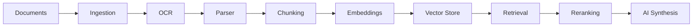

# LexMind

**Open Source Legal Intelligence Platform**

---

## Vision

LexMind transforms scattered legal documents into a structured, queryable
knowledge base. It combines OCR, parsing, embeddings, retrieval, and AI to
help legal professionals find evidence, build timelines, and detect
contradictions across thousands of pages.

## Architecture Overview

## Project Status

| Phase | Status |
|---|---|
| Foundation | In progress |
| Ingestion | Planned |
| Intelligence | Planned |
| Knowledge | Planned |
| Interface | Planned |

## Roadmap

See the full [Roadmap](docs/ROADMAP.md).

## Quick Links

- [Documentation](docs/README.md)
- [Glossary](docs/GLOSSARY.md)
- [Architecture](docs/02-architecture/README.md)
- [Development Guide](docs/27-development/README.md)
- [FAQ](docs/FAQ.md)

## Contributing

- [Contributing Guide](../CONTRIBUTING.md)
- [Code of Conduct](../CODE_OF_CONDUCT.md)
- [Security Policy](../SECURITY.md)

## License

Apache 2.0 — see [LICENSE](../LICENSE).
