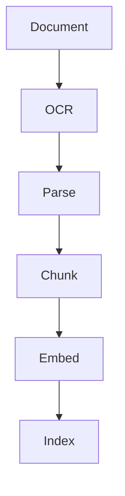
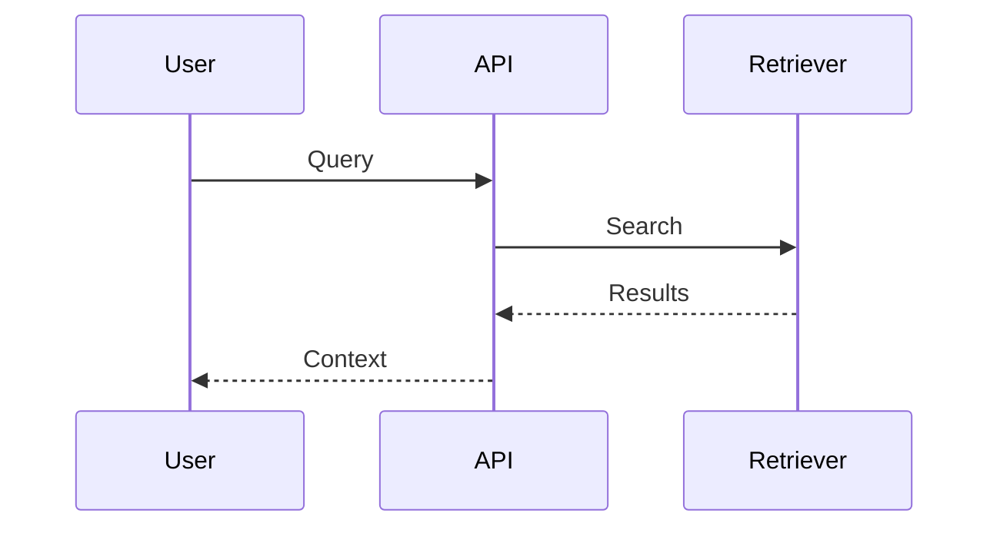
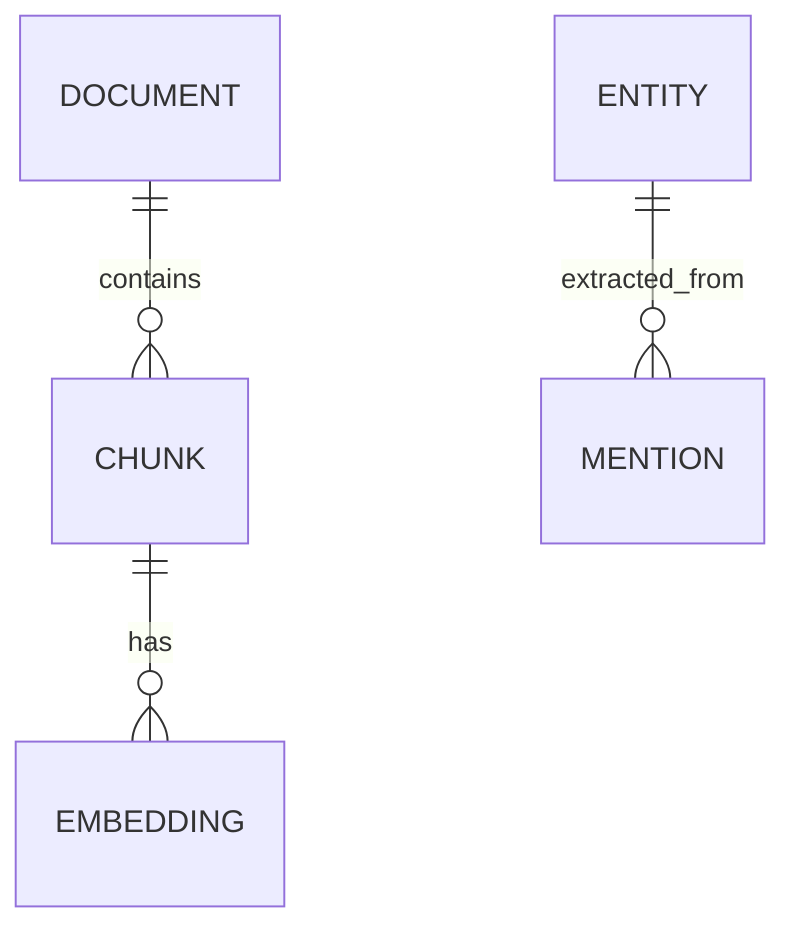
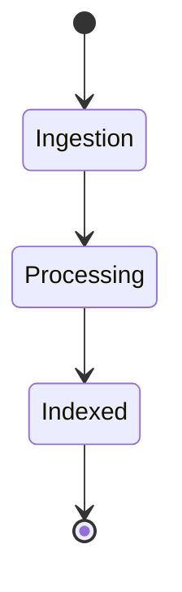
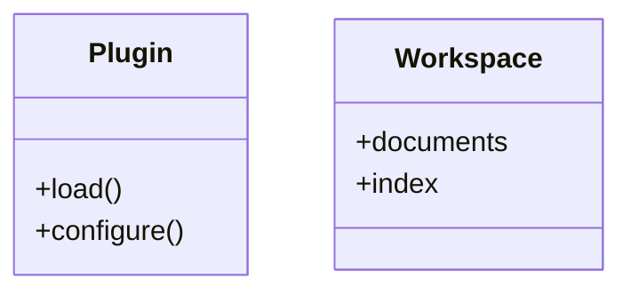
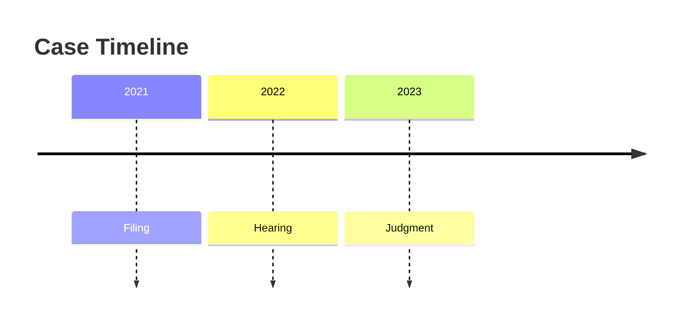

# Mermaid Examples

Example diagrams demonstrating the supported Mermaid rendering.

## Flowchart

## Sequence Diagram

## Entity Relationship Diagram

## State Diagram

## Class Diagram

## Timeline

